% The Phonological Influence on Phonetic Change
% Josef Fruehwald, University of Pennsylvania   September 4, 2013

---

# Introduction

1. Introduction to the Problem
2. Analyses
    1. Rate of Change
    2. Mismatches between phonetic and phonological predictions
3. Conclusions and Implications

---

## [Background](http://www.ling.upenn.edu/~joseff/assets/motion_chart.html)

<object data="http://www.ling.upenn.edu/~joseff/assets/motion_chart.html" style="width:100%;height:90%;"></object>

---

# Background

  

    <table padding=10px>
      <tr>
        <td >/ay/</td>
        <td>
          <!-- { -->
          <embed src = "assets/bracket.svg"  type="image/svg+xml" />
        </td>
        <td >
            &#45; high 
            <b>&#43; low</b> 
            &#43; back 
            &#45; round 
            &hellip; 
        </td>
      </tr>
    </table>
  

  

    <table padding=10px>
      <tr>
        <td>/ay/</td>
        <td>
          <embed src = "assets/bracket.svg"  type="image/svg+xml" />
        </td>
        <td>
            &#45; high 
            <b>&#45; low</b> 
            &#43; back 
            &#45; round 
            &hellip; 
        </td>
      </tr>
    </table>
  

  

    ay &rarr; -low/ __[-voice]
  

---

# Backround

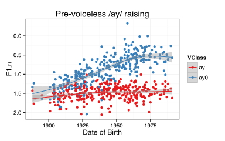

---

# Background
#### Error Accumulation?

</img>

Ohala (1981)

---

# Background

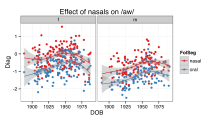

---

# The Data

The data for my dissertation is drawn from the Philadelphia Neighborhood Corpus
    
- Sociolinguistic interviews carried out for the Ling 560 Class
- I'm working with a subset of 735,408 measurements from 308 speakers from the PNC
- Phonetic alignment and formant analysis was automated using [the FAVE suite](http://fave.ling.upenn.edu/).

------------------

<!-- http://www.flickr.com/photos/usnationalarchives/sets/72157630314917356/with/7455138062/ -->

<myfig>

<figcaption>North Philadelphia Row Homes, 1973</figcaption>
</myfig>

------------------

<myfig>

<figcaption>South Philadelphia Row Homes, 2012</figcaption>
</myfig>

------------------

# The Use of Change in Progress

When we observe a language change in progress, the change is taking place in speakers' knowledge of their language from generation to generation.

- Speakers' supraglottal tracts are not changing meaningfully.
- The speed of sound at sea level isn't changing.
- Speakers' motor-planning abilities aren't changing meaningfully.

To know *which* aspect of their knowledge is changing, we really need to observe the sound change in progress.

---

# The Use of Change in Progress

#### Metathesis

1. It could be lexically gradual, moving one word at a time, possibly due to perceptual confusion (Blevins & Garret 2004)
    * e.g. chipotle -> chipolte
2. It could be due to a new phonological process being added to the grammar, which produces phonetically abrupt variation.
3. It could even be phonetically gradual
    * Andalusian pre-aspiration becoming post aspiration (Parrel, 2012; Ruch 2012)
         * ht > hth > th

In all three cases, the outcome is the same, but result from changes to three very different aspects of linguistic knowledge.

---

# The Theoretical Model

I'll adopt a model more or less similar to those proposed in the 80s and 90s in Generative Phonetics.

  

Lexicon

  

&darr;

  

Phonological grammar

  

&darr;

  

Phonology-Phonetics Interface

  

---

# The Theoretical Model

##### Phonetic Implementation 
As a [+back] vowel, /ow/ is mapped to a phonetic target for backness.

 \

This target can vary cross-dialectally, or change over time.

 \

 \ 

 \

---

# The Theoretical Model
In different contexts, this target for /ow/ will be subject to different coarticulatory pressures.

 \

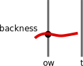 \ 

 
 
 
 

These coarticulatory pressures themselves may be subject to cross-dialectal variation and change (Zsiga 2000).

 \

 \ 

---

# The Theoretical Model
Or, a phonological process may produce an /ow/ allophone with a different target of phonetic implementation.

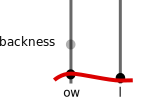 \

 \ 

##### Phonetic Variants
Shared target of phonetic implementation, perturbed by coarticulatory pressures.

##### Phonological Variants
Different surface phonological representations, thus different phonetic targets.

---

# The Theoretical Model

Phonetics 
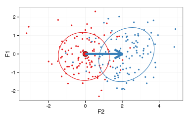\ 

The target of one variant is yoked to the other.

Phonology 

The two targets are independent.

These will produce different patterns of change.

# The rate of change.
##### Phonetics

# The rate of change.
##### Phonology

# The rate of change.
##### Reanalysis

# The rate of change.
##### Phonetics

# The rate of change.
##### Phonology
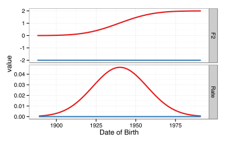

# The rate of change
##### Reanalysis

---

# Modeling the Rate of Change
 
By trying to see where in the course of a sound change the rates of change of vowel variants diverge, we can see when phonological reanalysis occurred.

For this analysis, I looked at three vowels: /aw/, /ow/ and /uw/

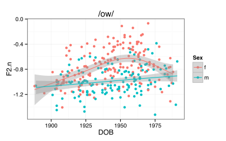

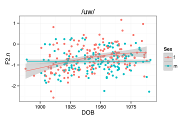

---

# Modeling the Rate of Change

Since the trajectories of change of these vowels are clearly not linear, or even monotonic, I had to do something more complicated than linear regression.

##### Basic Model

<ul class = "incremental">
<li> I modeled year-over-year change as a latent variable, which I call &delta;</li>
<li> The estimated target for a given birth year is the sum of &delta; from the earliest DOB up until the year in question. I'm calling that value &Delta;</li>
<li>I modeled each speaker's target as being normally distributed around the &Delta; for their DOB (a &mu; for each speaker.)</li>
<li>The data from each speaker is normally distributed around their &mu;.</li>
<li>There are also words specific random effects, normally distributed around 0.</li>
</ul>

---

# Modeling the Rate of Change

For modeling the year-over-year change (&delta;), I used b-splines.

---

# Modeling the Rate of Change

The model was implemented in Stan, which estimates Bayesian models like this via Hamiltonian Monte Carlo.

* Each model was fit with 3 chains, with a burn in of 750 iterations. These models converged very quickly.
* Convergence was evaluated using the Gelman-Rubin Diagonstic

---

# Modeling the Rate of Change

---

# Modeling the Rate of Change

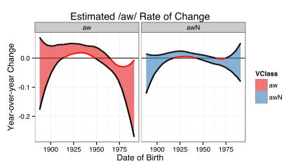

---

# Modeling the Rate of Change

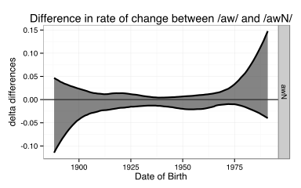

---

# Modeling the Rate of Change

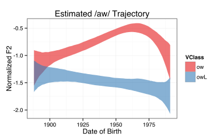

---

# Modeling the Rate of Change

---

# Modeling the Rate of Change

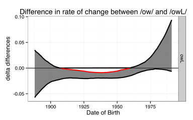

---

# Modeling the Rate of Change

According to the model:

<table>

<tr>
  <td>
    Year when /ow/ rate of change first &gt; 0:
  </td>
  <td>
1906
  </td>
</tr>

<tr>
  <td>
    Year when /ow/ rate of change first &ne; /owL/ rate of change:
  </td>
  <td>
1908
  </td>
</tr>

</table>

This difference is smaller than the possible precision of the model.

---

# Modeling the Rate of Change

#### Summary of results

<table>
<tr>
  <td></td>
  <td>/aw/</td>
  <td>/ow/</td>
  <td>/uw/</td>
</tr>
<tr>
  <td>__[nasal]</td>
  <td>Always Parallel</td>
  <td>Potential Reanalysis</td>
  <td></td>
<tr>
<tr>
  <td>[nasal]__</td>
  <td>  </td>
  <td>Always Parallel</td> 
  <td></td>
</tr>
<tr>
  <td>__l</td>
  <td></td>
  <td>Divergent from start</td>
  <td>Divergent from start</td>
</tr>
<tr>
  <td>__#</td>
  <td>Always Parallel</td> 
  <td>Ceiling Effect</td>
  <td>Always Parallel</td>
</tr>
<tr>
  <td>[cornal]__ </td>
  <td> </td>
  <td></td>
  <td>Ambiguous</td>
</tr>
</table>

---

# Modeling the Rate of Change
#### /owN/ reanalysis?

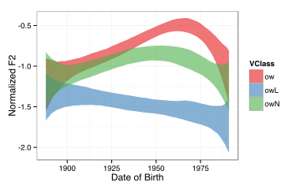

---

# Modeling the Rate of Change
#### /owN/ reanalysis?

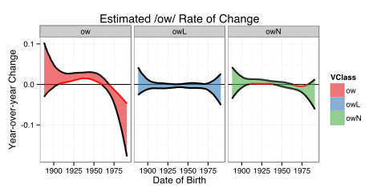

---

# Modeling the Rate of Change

#### Wrapup
For all of these vowel variants, I found only one case that fit the quantitative profile of phonological reanalysis, and even that is not clear cut.

I also found two cases which were categorically exempt from their sound change from its onset, which is not predicted under the gradual reanalysis account.

---

# Mismatches

The model of gradual reanalysis would predict that phonetic changes should progress from the most favoring environment to the least. 

In some cases, there is a mismatch between contexts which phonetically favor a change, and the eventual phonological conditioning in its outcome.

---

# Mismatches

#### /ay/ raising

(Joos, 1942; Chambers, 1973; Moreton & Thomas, 2007)

---

# Mismatches

Faithful /d/ (235 ms) &gt; Flapped /d/ (156 ms); Faithful /t/ (143 ms); Flapped /t/ (113 ms)

---

# Mismatches

It looks like /ay/ raising differentiates along phonological, not phonetic dimensions.

---

# Mismatches

/ay/ differentiates between pre-/t/ and pre-/d/ contexts in the exact same way whether the /t/ and /d/ are faithful, or flapped.

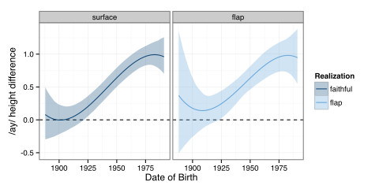

---

# Mismatches

#### /ey/ raising

---

# Mismatches
#### /ey/ raising

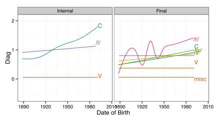

---

# Mismatches

`lmer(Diag ~ Decade*FolSeg + (FolSeg | Speaker) + (1|Word))`

Decade is date of birth minus 1900 divided by 10.

<table rules="groups">

<th>
<td colspan = 2 align = "left" padding="0"> 
  C Estimates
</td>
<td></td>
<td colspan = 3 align = "left">
  Interactions
</td>
</th>
<tbody>
<tr>
<td rowspan = "2" valign = "top">
Intercept
</td>
<td align="right">
0.67
</td>
<td align="right" style="font-size:8pt;">
t = 17.02
</td>
<td></td>
<td align="right">
-0.59
</td>
<td align="right" style="font-size:8pt;">
t = -4.83
</td>
<td >
FolSeg = V
</td>
</tr>
<tr>
<td>
</td>
<td>
</td>
<td></td>
<td align="right" style = "font-weight:800;color:#7570B3;">
0.28
</td>
<td align="right" style="font-size:8pt;font-weight:800;color:#7570B3;">
t = 2.53
</td>
<td style = "font-weight:800;color:#7570B3;">
FolSeg = /l/
</td>
</tr>
</tbody>

<tbody>
<tr>
<td rowspan = "2" valign = "top">
Decade
</td>
<td align="right">
0.12
</td>
<td align="right" style="font-size:8pt;">
t = 15.56
</td>
<td></td>
<td align="right">
-0.12
</td>
<td align="right" style="font-size:8pt;">
t = -6.35
</td>
<td >
FolSeg = V  &times; Decade
</td>
</tr>
<tr>
<td>
</td>
<td>
</td>
<td></td>
<td align="right" style = "font-weight:800;color:#7570B3;">
-0.08
</td>
<td align="right" style="font-size:8pt;font-weight:800;color:#7570B3;">
t = -4.12
</td>
<td style = "font-weight:800;color:#7570B3;">
FolSeg = /l/ &times; Decade
</td>
</tr>
</tbody>
</table>

---

# Mismatches
#### Wrapup

Phonetic favoribility is a weak predictor of which variants will undergo a change.

First is not fastest.

*Phonological* conditioning is present at the onset of these changes.

---

# Conclusions and Analysis

The conventional wisdom regarding the gradual phonological reanalysis of phonetic effects:

1. Either doesn't happen, or happens too rarely to be observed in the sound changes I've analyzed.
2. Can't account for a number of the patterns in sound changes that I've observed.
3. My proposal that phonetic changes operate over surface phonological representations makes additional predictions which are borne out (e.g. parallel phonetic shifts of phonological natural classes).

---

# Conclusions and Analysis

I have observed that when there is clear phonological conditioning of a sound change towards its end, that phonological conditioning is also in place at the sound change's onset.

#### Proposal

New phonological processes enter the grammar as strictly phonological innovations, not reanalyses of phonetic processes, and have relatively small phonetic correlates at first. This is similar to the "Big Bang" theory of Joseph & Janda.

---

# Is this Plausible?

There are plenty of examples children briefly entertaining phonological hypotheses which are markedly absent from the adult grammar, like Consonant Harmony.

<table>
<tr>
  <td>
    Word
  </td>
  <td>
    Ahmal
  </td>
<tr>
  <td>
    <i>duck</i>
  </td>
  <td>
    g̊ʌk
  </td>
<tr>
<tr>
  <td>
    <i>kiss</i>
  </td>
  <td>
    g̊ik
  </td>
</tr>
<tr>
  <td>
    <i>stop</i>
  </td>
  <td>
    d̥ɔp ~b̥ɔp
  </td>
</tr>

</table>

(Smith (1973), quoted in Goad (1997))

---

# Is this Plausible?

#### Why aren't we in phonological chaos?

Learning, both linguistic and social, could iron out a lot of idiosyncratic variation.

---

# Is this Plausible?

#### Why aren't we in phonological chaos?

How do we know we aren't?

</img>

Mielke, Baker, Archangeli (forthcoming)

---

# Conclusions

* A model of phonetic change taking into account a strong but distinct role of phonology does a better job analyzing and predicting the observed patterns of sound change than one without.
* The study of sound change in progress offers unique insight into the interrelationship between phonology and phonetics, and vice versa.
* My proposal, and is consequences for understanding sound change introduces many more interesting questions and avenues of research.

---

# A few more numbers

<table>
<tr class = "incremental">
<td>
  
Age
    
</td>
<td>
    
10,469 days

</td>    
</tr>

<tr class = "incremental">
<td>
  
At Penn
    
</td>
<td>
    
3,654 days

</td>    
</tr>

<tr class = "incremental">
<td>
  
In linguistics
    
</td>
<td>
    
3,283 days

</td>    
</tr>

</table>

3283&frasl;10469 = 31% of my life

*****

---

# References

* Ash, S. (1982). The Vocalization of /l/ in Philadelphia. University of Pennsylvania.
* Baker, A., Archangeli, D., & Mielke, J. (2011). Variability in American English s-retraction suggests a solution to the actuation problem. Language Variation and Change, 23, 347–374.
* Bailey, C.-J. (1973). Variation and Linguistic Theory. Washington.
* Bermúdez-Otero, R. (2007). 21 Diachronic Phonology. In P. de Lacy (Ed.), The Cambridge Handbook of Phonology (pp. 497–517). Cambridge: Cambridge University Press.
* Blevins, J. (2004). Evolutionary phonology: the emergence of sound patterns. Cambridge University Press.
* Blevins, J., & Garrett, A. (2004). The Evolution of Metathesis. In B. Hayes, R. Kirchner, & D. Steriade (Eds.), {Phonetically Based Phonology} (pp. 117–156). New York: Cambridge University Press.
* Chambers, J. K. (1973). Canadian Raising. Canadian Journal of Linguistics, 18, 131–135.
* Dinkin, A (2011). What's Really Happening to Short A Before L in Philadelphia? Talk presented at NWAV 40, Washington, D.C.
* Fruehwald, J. (2008). The Spread of Raising : Opacity , Lexicalization , and Diffusion. Penn Working Papers in Linguistics, 14(2), 83–92.
* Conn, J. (2005). Of 'moice' and men: The evolution of a male-led sound change. University of Pennsylvania.
* Hyman, L. (1976). Phonologization. In A. Juilland, A. M. Devine, & L. D. Stephens (Eds.), Linguistic studies offered to Joseph Greenberg on the Occasion of His Sixtieth Birthday (Vol. 4, pp. 407–418). Anima Libri.
* Joos, M. (1942). A phonological dilemma in Canadian English. Language, 18, 141–144.
* Labov, W. (2001). Principles of linguistic change. Volume 2: Social Factors. Language in Society. Oxford: Blackwell.
* Labov, W., Rosenfelder, I., & Fruehwald, J. (2013). One hundred years of sound change in Philadelphia: Linear Incrementaion, Reversal, and Reanalysis. Language, 89(1), 30–65.

---

# References

* Moreton, E., & Thomas, E. R. (2004). Origins of Canadian Raising in voiceless-coda effects: a case study in phonologization. In J. Cole & J. I. Hualde (Eds.), Papers in Laboratory Phonology 9. Cambridge University Press.
* Ohala, J. (1981). The listener as a source of language change. In C. S. Masek, R. A. Hendrick, & M. F. Miller (Eds.), Papers from the Parasession on Language and Behavior. Chicago Linguistics Society.
* Ohala, J. J. (1990). The phonetics and phonology of aspects of assimilation. In J. Kingston & M. E. Beckman (Eds.), Papers in laboratory phonology 1: Between the grammar and physics of speech (pp. 258–282). Cambridge: Cambridge University Press.
* The Philadelphia Neighborhood Corpus.
* Stan Development Team. (2012). Stan: A C++ Library for Probability and Sampling. Retrieved from http://mc-stan.org/
* Tucker, R. W. (1944). Notes on the Philadelphia dialect. American Speech, 19(1), 37–42.
* Wagner, S. E. (2007). We act like girls and we don’t act like men: The use of the male-associated variable (ay0) in South Philadelphia. In T. Scheffler, J. Tauberer, A. Eilam, & L. Mayol (Eds.), Penn Working Papers in Linguistics (Vol. 13.1, pp. 393–406). Philadelphia: University of Pennsylvania Press.

